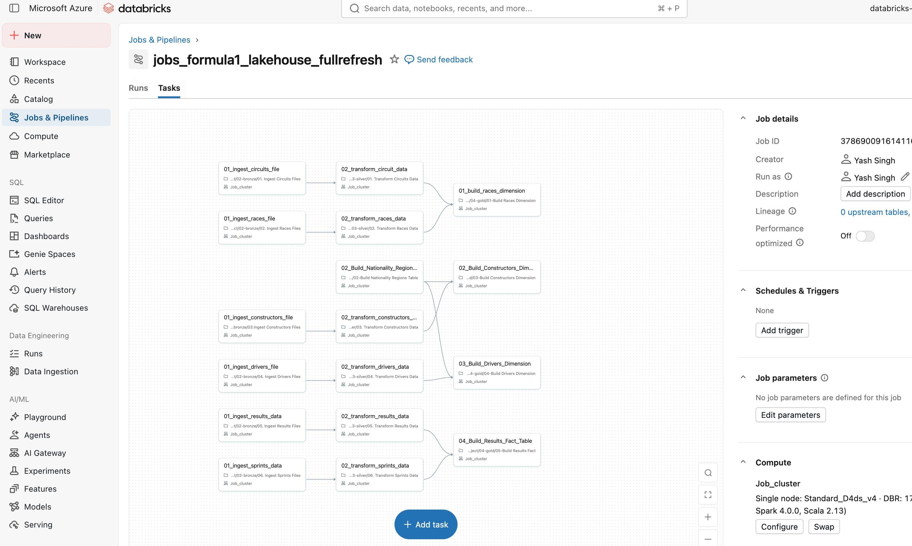

# Formula 1 Analytics Lakehouse — Azure Databricks

An end-to-end data engineering project that ingests, transforms, and models Formula 1
motor racing data into a dimensional model on **Azure Databricks**, following the
**Medallion architecture** (Bronze → Silver → Gold). Curated tables are exposed for
analytics through Databricks SQL and dashboards.

## Pipeline Overview

The full-refresh job (`jobs_formula1_lakehouse_fullrefresh`) orchestrates ingestion,
transformation, and modelling tasks with Lakeflow Jobs:

## Architecture

- **Bronze** — Raw ingestion of source files (circuits, races, constructors, drivers,
  results, sprints) into Delta Lake.
- **Silver** — Cleaned and conformed tables produced with PySpark and Spark SQL.
- **Gold** — Dimensional model: `races`, `drivers`, and `constructors` dimensions plus a
  `results` fact table, ready for reporting.

## Tech Stack

- Azure Databricks
- Apache Spark (PySpark & Spark SQL)
- Delta Lake
- Unity Catalog (governance & organisation)
- Lakeflow Jobs (orchestration)
- Databricks SQL & Dashboards (analytics)

## Data Source

Formula 1 data is sourced from the open-source
[**jolpica-f1**](https://github.com/jolpica/jolpica-f1) project — an open API for querying
Formula 1 data and the backwards-compatible successor to the soon-to-be-deprecated Ergast
API. The project is licensed under Apache-2.0; please review its
[Terms of Use](https://github.com/jolpica/jolpica-f1/blob/main/TERMS.md) before use.

## Notes

This is a self-directed learning project built to demonstrate a production-style lakehouse
pipeline and dimensional modelling on Databricks. It is not affiliated with Formula 1 or
the jolpica-f1 maintainers.
